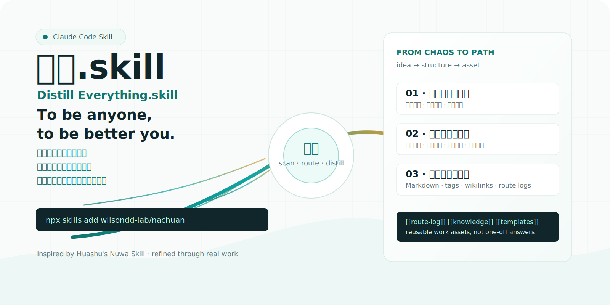

# 纳川.skill

> To be anyone, to be better you.

[English](README.en.md) · [日本語](README.ja.md) · [한국어](README.ko.md) · [Español](README.es.md) · [Français](README.fr.md) · [Deutsch](README.de.md) · [Português](README.pt.md) · [العربية](README.ar.md)

[](LICENSE)
[](https://claude.com/code)

**Distill Everything.skill** 是纳川.skill 的英文名。

纳川.skill 是一个面向 Claude Code 的通用材料蒸馏 Skill：把 PDF、PPT、网页、会议转写、研究资料、草稿和零散笔记先读明白，再路由到合适的加工管线，最后沉淀为可以复用的知识、结构和内容资产。

它不是一个“多写几条提示词”的工具，而是一套先扫描、再判断、再执行的工作流。

---

## 为什么叫纳川

纳川不是词典里的“海纳百川”，而是一条工作里的河。

信息是散的，纳川把它们收拢；
结构是隐的，纳川让它显形；
选择是多的，纳川先指一条路；
意图是模糊的，纳川把它变成可用的东西。

当我们有很多想法，却总觉得说不清；
当我们想做很多事，却不知道第一步该落在哪里；
当资料、链接、转写、截图和草稿堆在一起，只剩下一团没有入口的混沌；
当灵感已经来了，结构还没有来；
当我们需要的不是一句“总结一下”，而是一个能继续往前推进的判断和路径。

纳川.skill 要接住的，就是这些还没有成形的水流。

它受花叔女娲 Skill 启蒙。女娲带来的核心启发是：Skill 的本色不是更长的 prompt，而是把经验、判断、选择和工作流炼成一个可以被反复调用的系统。纳川在这个基础上，把焦点放在更前段的现实问题：先容纳，先辨流，先看见结构，再把材料送进合适的管线。

所以 **To be anyone, to be better you.** 不是复刻谁。它指的是从不同材料里吸收方法、结构、判断和表达能力，把“我想做但说不清”的东西，变成我能执行、能沉淀、能再次调用的资产。

---

## 核心亮点

| 核心能力 | 它真正解决的事 | 结果 |
|---|---|---|
| **把混沌变成选择** | 你不知道该问什么、该先做什么 | 先给材料画像，再给推荐路线和备选路径 |
| **把想法变成路径** | 想做的很多，但缺少可执行顺序 | 用 A/B/C/D 四路管线拆开任务、串起步骤 |
| **把输出变成资产** | AI 回答常常只停留在一次对话里 | 沉淀为 Markdown、标签、双向链接、路由日志和模板 |

---

## 四路管线

| 路线 | 名称 | 适合什么时候用 | 典型产出 |
|---|---|---|---|
| **A** | 精华萃取 | 你需要抓核心观点、关键判断、可复用规律 | 精华摘要、判断列表、规律卡片 |
| **B** | 结构拆解 | 你需要看清叙事、框架、页面或段落组织方式 | 结构图、表达模式、框架摘要 |
| **C** | 知识提取 | 你想把材料沉淀进长期知识库 | Markdown 笔记、YAML 标签、`[[双向链接]]` |
| **D** | 内容生成 | 你要把已提取的知识转成新的表达 | 文案、脚本、大纲、说明、模板、草稿 |

可单选，可并行，也可串联。比如先走 C 把材料沉淀成知识，再走 D 生成新的表达。

---

## 工作流

1. **投入材料**：拖入文档、网页、转写、笔记或混合资料包。
2. **静默扫描**：识别材料类型、规模、结构、关键词和潜在价值。
3. **给出选择题**：不是开放式追问，而是给出推荐路线和备选路线。
4. **执行管线**：按用户选择进入 A/B/C/D 单路、并行或串联处理。
5. **沉淀结果**：把输出整理为可查找、可链接、可继续生成的 Markdown 资产。

---

## 适合什么材料

- PDF、长文、报告、白皮书
- PPT、演示稿、方案、页面草稿
- 网页、链接、公开资料、研究摘录
- 会议转写、访谈记录、语音整理稿
- 零散笔记、想法片段、待整理素材
- 多文件混合资料包

纳川.skill 不绑定任何单一领域。只要材料需要先被看清、拆开、提炼、入库或再表达，它就可以作为入口。

---

## 输出格式

默认输出面向长期复用，而不是一次性聊天记录：

- **Markdown**：通用、可读、易版本管理
- **YAML metadata**：便于分类、检索和自动化处理
- **`[[wikilinks]]`**：适合 Obsidian 或任何支持双向链接的笔记系统
- **路由日志**：记录本次选择了什么路线，以及为什么这么处理
- **生成资产**：把可复用的结构、模板、脚本或文案留在本地

---

## 安装

```bash
npx skills add wilsondd-lab/nachuan
```

也可以手动安装：

```bash
mkdir -p ~/.claude/skills
cd ~/.claude/skills
git clone https://github.com/wilsondd-lab/nachuan.git
```

---

## 快速开始

你可以直接这样说：

```text
帮我看看这个文档里有什么。
把这份 PPT 拆一下。
提取里面可以复用的知识点。
这组材料先帮我判断怎么处理。
```

纳川.skill 会先给出材料扫描结果，再让你选择下一步路线。

---

## 来源与致谢

纳川.skill 启蒙于花叔的女娲 Skill。

真正打动我的地方是：Skill 不只是提示词，它可以把经验、判断、路径选择和工作流沉淀成一个可以被反复调用的系统。纳川.skill 在这个启发上，结合真实一线工作中的材料处理场景迭代了四到五轮，重点放在“先判断怎么处理，再进入合适管线”这件事上。

感谢花叔和女娲 Skill 带来的启发。

---

## License

MIT © Wilson
